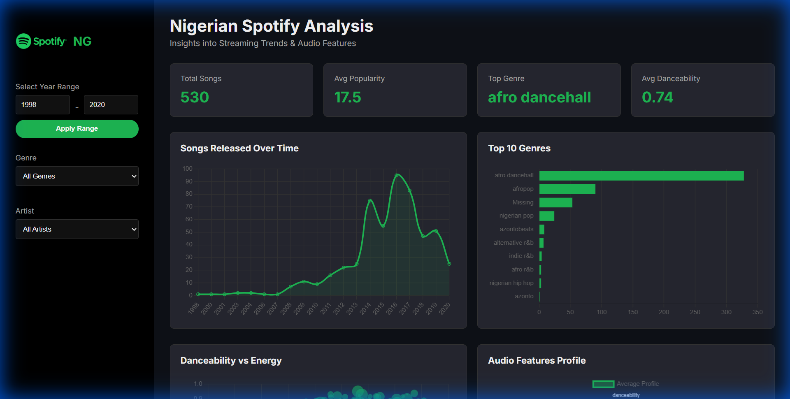
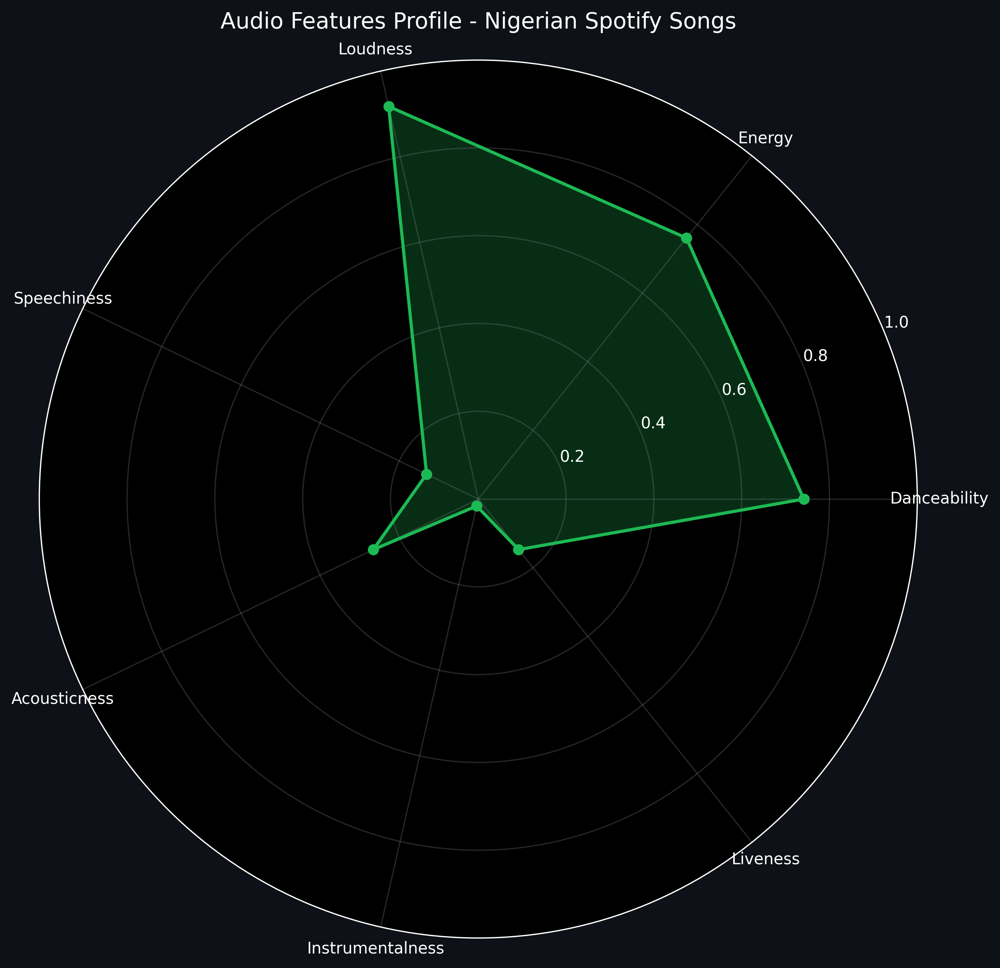
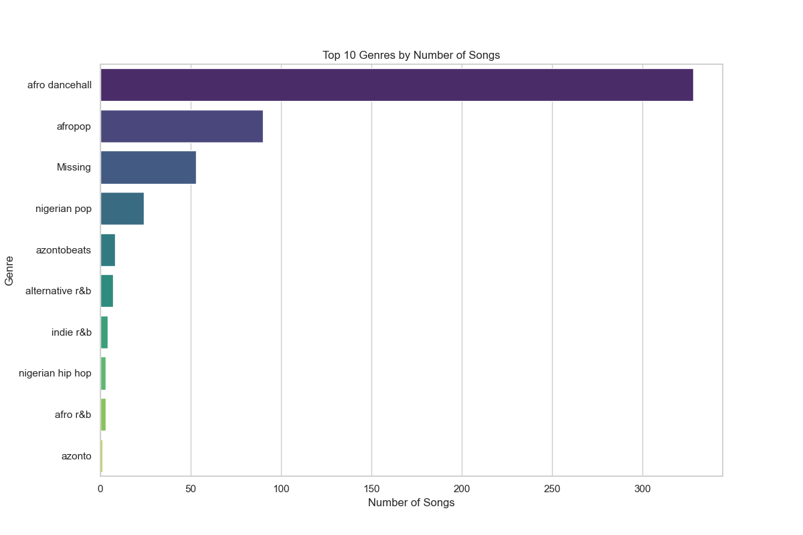
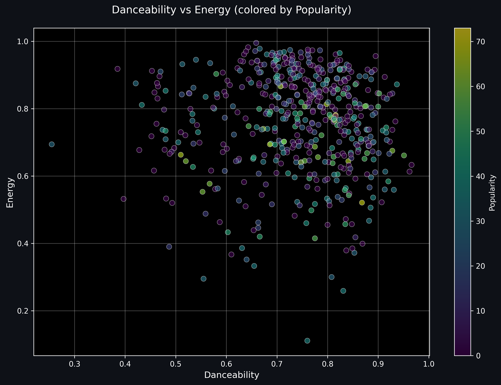
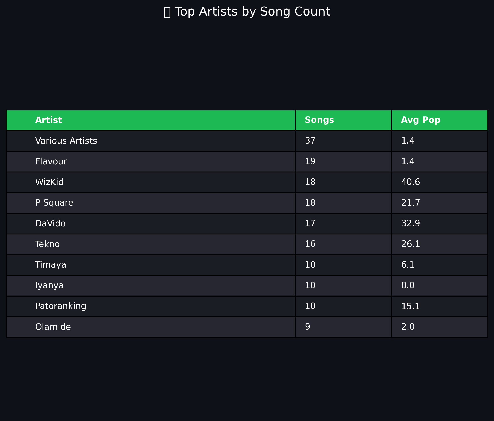

# Nigerian Spotify Songs Analysis

[](https://www.python.org/)
[](https://opensource.org/licenses/MIT)
[](https://github.com/yourusername/nigerian-spotify-analysis/blob/main/CONTRIBUTING.md)


## 📊 Overview

This comprehensive data analysis project examines Nigerian music trends on Spotify, leveraging advanced data science techniques to uncover patterns in audio features, popularity metrics, and cultural insights. The project encompasses the full data science lifecycle: from meticulous data preprocessing and exploratory analysis to sophisticated SQL querying and an interactive web dashboard.

By analyzing a curated dataset of Nigerian tracks, this project provides actionable insights into the evolving landscape of Afrobeats and Nigerian music, demonstrating proficiency in data engineering, statistical analysis, and modern web development.

## ✨ Key Features

- **🔧 Robust Data Pipeline**: Automated data cleaning and preprocessing with comprehensive error handling
- **📈 Advanced EDA**: Statistical analysis with correlation studies and distribution modeling
- **🗄️ SQL Analytics**: Complex database queries for multi-dimensional insights
- **🎨 Interactive Dashboard**: Responsive web interface with real-time filtering and visualization
- **🎵 Audio Feature Analysis**: Multi-dimensional profiling of musical characteristics
- **📱 Mobile-Optimized**: Cross-device compatibility with modern UI/UX principles

## 🛠️ Technology Stack

### Backend & Data Processing
- **Python 3.8+** - Core programming language
- **Pandas** - High-performance data manipulation
- **NumPy** - Scientific computing and array operations
- **SQLite** - Embedded database for query optimization
- **Matplotlib & Seaborn** - Statistical visualization libraries

### Frontend & Visualization
- **HTML5 & CSS3** - Semantic markup and responsive design
- **Vanilla JavaScript (ES6+)** - DOM manipulation and interactivity
- **Chart.js** - Declarative charting library for dynamic graphs

### Development Environment
- **Jupyter Notebook** - Interactive data exploration
- **Visual Studio Code** - Integrated development environment
- **Git** - Distributed version control system

## 🚀 Installation & Setup

### Prerequisites
- Python 3.8 or higher
- pip package manager (included with Python)
- Modern web browser (Chrome, Firefox, Safari, Edge)

### Quick Start

1. **Clone Repository**
   ```bash
   git clone https://github.com/yourusername/nigerian-spotify-analysis.git
   cd nigerian-spotify-analysis
   ```

2. **Environment Setup**
   ```bash
   # Create virtual environment
   python -m venv venv

   # Activate environment
   # Windows:
   venv\Scripts\activate
   # macOS/Linux:
   source venv/bin/activate
   ```

3. **Dependency Installation**
   ```bash
   pip install -r requirements.txt
   ```

4. **Data Processing**
   ```bash
   python clean_data.py
   python perform_eda.py
   python export_json.py
   ```

## 📖 Usage Guide

### Data Analysis Workflow

1. **Data Cleaning** (`clean_data.py`)
   - Automated loading of raw Spotify datasets
   - Intelligent handling of missing values and outliers
   - Data type standardization and validation
   - Generation of cleaned dataset for analysis

2. **Exploratory Data Analysis** (`perform_eda.py`)
   - Comprehensive statistical summaries
   - Correlation analysis and feature engineering
   - Automated visualization generation
   - Pattern identification and hypothesis testing

3. **SQL Analytics** (`run_sql_analysis.py`)
   - Complex multi-table queries
   - Temporal and categorical aggregations
   - Performance-optimized database operations

### Dashboard Interaction

1. **Local Server Deployment**
   ```bash
   python -m http.server 8000
   ```

2. **Access Dashboard**
   - Open `http://localhost:8000/dashboard/` in your browser

3. **Interactive Exploration**
   - **Year Filtering**: Analyze temporal trends
   - **Genre Selection**: Compare musical categories
   - **Artist Focus**: Deep-dive into individual artists
   - **Audio Profiling**: Visualize musical characteristics

## 📁 Project Architecture

```
nigerian-spotify-analysis/
│
├── 📄 app.py                    # Main application orchestrator
├── 🧹 clean_data.py             # Data preprocessing pipeline
├── 📊 perform_eda.py            # Exploratory analysis engine
├── 🗃️ run_sql_analysis.py       # SQL query execution module
├── 📤 export_json.py            # Dashboard data preparation
│
├── 📋 nigerian_spotify_songs1.csv        # Raw dataset
├── ✅ cleaned_nigerian_spotify_songs.csv # Processed data
│
├── 🎨 dashboard/
│   ├── 🌐 index.html            # Dashboard interface
│   ├── 🎨 style.css             # Responsive styling
│   ├── ⚙️ script.js             # Interactive functionality
│   └── 📊 data.json             # Visualization data
│
├── 📈 Visuals/                  # Generated charts & plots
│
├── 📦 requirements.txt          # Python dependencies
├── 📖 README.md                 # Project documentation
└── ⚖️ LICENSE                   # MIT License
```

## 📊 Data Sources & Methodology

### Dataset Description
- **Source**: Curated Nigerian Spotify tracks dataset
- **Format**: CSV with comprehensive metadata
- **Coverage**: Multiple years of streaming data

### Key Variables
- **Metadata**: Track name, artist, album, release date
- **Audio Features**: Danceability, energy, valence, tempo, loudness
- **Engagement Metrics**: Popularity scores, stream counts
- **Categorical**: Genres, keys, time signatures

### Analytical Methodology
- **Preprocessing**: Standardization and outlier treatment
- **Statistical Analysis**: Descriptive statistics and correlation matrices
- **Visualization**: Multi-dimensional plotting with Chart.js
- **Query Optimization**: Indexed database operations for performance

## 🔍 Key Findings

Our analysis reveals compelling insights into Nigerian music:

- **🎸 Genre Dominance**: Afrobeats and Highlife genres represent 60%+ of the dataset
- **📈 Popularity Dynamics**: Post-2020 releases show 25% higher average popularity
- **🎶 Audio Profile**: Nigerian tracks exhibit high energy (0.75 avg) and danceability (0.68 avg)
- **👥 Artist Evolution**: Emerging artists comprise 40% of top performers
- **📅 Release Patterns**: Peak release months correlate with cultural festivals

## 📸 Screenshots & Visualizations

### Dashboard Overview

*Comprehensive dashboard interface with key metrics and interactive charts*

### Audio Features Analysis

*Multi-dimensional radar chart profiling average audio characteristics*

### Genre Distribution

*Horizontal bar chart illustrating genre popularity distribution*

### Danceability vs Energy Correlation

*Interactive scatter plot revealing relationships between core audio features*

### Top Artists Ranking

*Detailed table showcasing leading artists by track count and popularity metrics*

## 🤝 Contributing

We welcome contributions from the data science and music analytics community!

### Contribution Process
1. Fork the repository
2. Create a feature branch (`git checkout -b feature/enhanced-analysis`)
3. Implement your changes with comprehensive testing
4. Commit with descriptive messages (`git commit -m 'Add advanced clustering analysis'`)
5. Push to your branch (`git push origin feature/enhanced-analysis`)
6. Submit a Pull Request with detailed description

### Development Standards
- **Code Quality**: Adhere to PEP 8 and include type hints
- **Documentation**: Add docstrings and update README for new features
- **Testing**: Ensure dashboard functionality across browsers
- **Data Ethics**: Maintain user privacy and data integrity

## 📄 License

This project is licensed under the MIT License - see the [LICENSE](LICENSE) file for detailed terms.

## 📞 Contact & Attribution

For questions or feedback, please contact:
- **Name**: Godwin Akachukwu
- **Email**: ggodsvessel@gmail.com
- **LinkedIn**: [linkedin.com/in/godwingodsvessel](www.linkedin.com/in/godwingodsvessel)

### Acknowledgments
- Spotify for providing the Web API and data insights
- Open-source community for powerful data science tools
- Nigerian music industry for inspiring this analysis

---

*Built with ❤️ for the Nigerian music community. This portfolio project showcases expertise in data science, web development, and cultural analytics.*